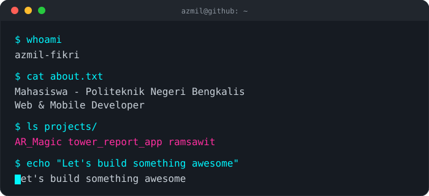

 

 

 

<h3 align="center">📈 GitHub Stats</h3>

  
  

  

<h3 align="center">🐍 Contribution Snake</h3>

  <picture>
    <source media="(prefers-color-scheme: dark)" srcset="https://raw.githubusercontent.com/azmil-fikri/azmil-fikri/output/github-contribution-grid-snake-dark.svg" />
    
  </picture>

  

